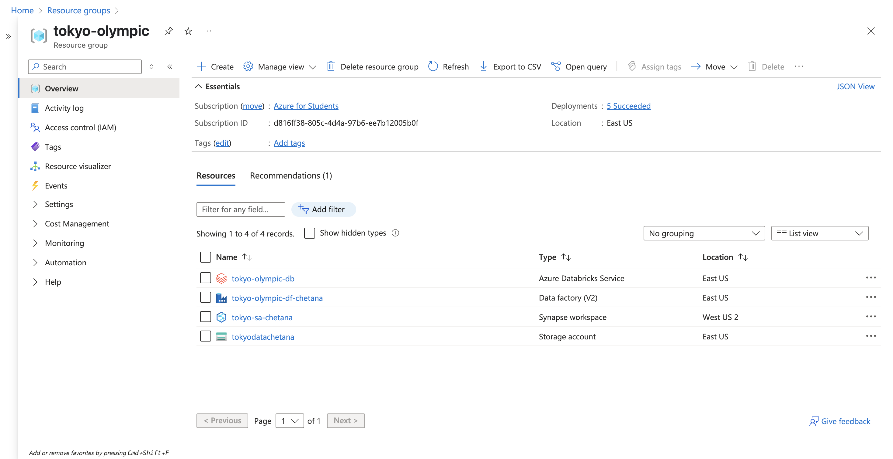
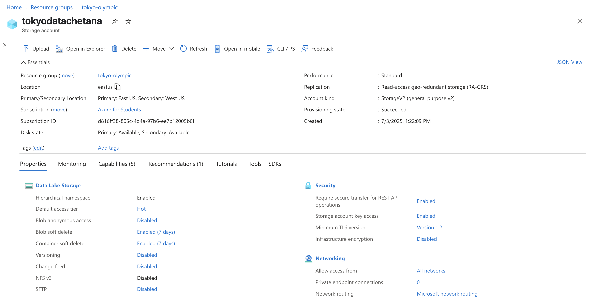
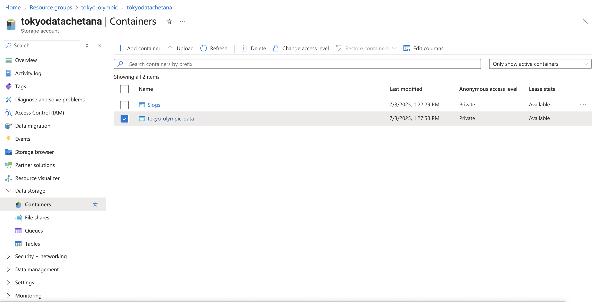
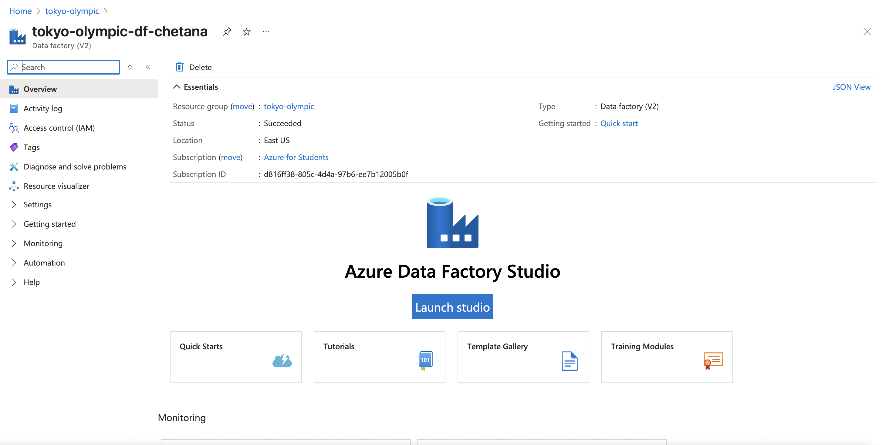
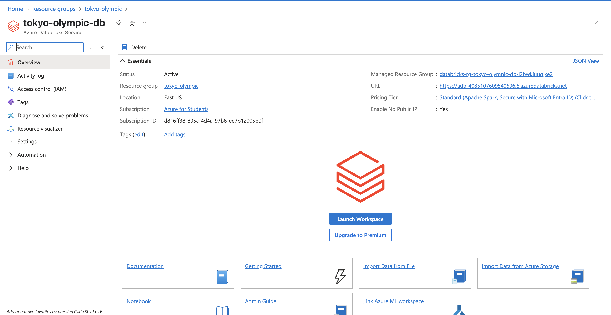
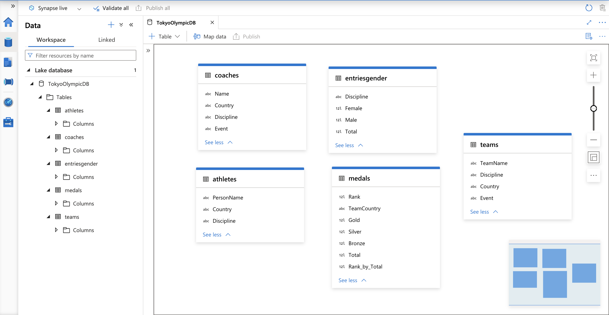

# 🏅 Tokyo Olympics ETL & Analytics Pipeline (Azure + Databricks + Tableau)

This project demonstrates a complete end-to-end ETL (Extract, Transform, Load) data pipeline for processing and analyzing Tokyo Olympics data using Azure Data Services, Apache Spark, and Tableau.

---

## 📌 Project Overview

We built a full data engineering and analytics workflow on Azure to extract raw data, transform it using PySpark in Databricks, store it in Azure Data Lake Storage Gen2, and analyze it with Synapse Analytics. Finally, we visualized the processed data in Tableau Public.

---

## 🗂️ Project Workflow

### ✅ Step 1: Resource Group Setup

- Created an Azure **Resource Group** to manage and organize all related resources centrally.

---

### ☁️ Step 2: Storage Setup

- Created an Azure **Storage Account** with **Hierarchical Namespace (HNS)** enabled to support Data Lake Gen2.
- Inside the storage account:
  - Created a **container** named `tokyo-olympic-data`.
  - Added two **directories**:
    - `raw-data/`
    - `transformed-data/`

---

### 🛠 Step 3: Data Ingestion with Azure Data Factory

- Created a **Data Factory** resource and launched the **ADF Studio**.
- Developed a pipeline using the **Copy Data** activity to:
  - Extract CSV files from a **public HTTP source** (e.g., GitHub).
  - Load them into the `raw-data/` folder in the Data Lake Gen2 container.
- Configured:
  - Source: HTTP Linked Service
  - Sink: ADLS Gen2 Linked Service
- Used the **debug + validation** features to test the pipeline before production.
- Attached a **trigger** to automate pipeline execution.

---

### ⚡ Step 4: Data Transformation with Azure Databricks

- Created a **Databricks workspace** and a **Spark cluster**.
- Connected Databricks to **ADLS Gen2** using:
  - **App Registration** (Azure AD)
  - Generated `client_id`, `client_secret`, and `tenant_id`
  - Configured access with **IAM Role Assignment** for read/write permissions
- Created and ran a **PySpark notebook** to:
  - Read CSV files from `raw-data/`
  - Clean and transform the data
  - Write the cleaned data to the `transformed-data/` folder

---

### 🧠 Step 5: Analytics with Azure Synapse

- Created a **Synapse workspace** and connected it to the Data Lake Gen2 storage.
- Created a **Lake Database** and external **tables** pointing to the transformed CSVs.
- Queried the tables using **SQL scripts** to generate insights and validate results.

---

### 📊 Step 6: Visualization with Tableau

- Exported data from Synapse or Data Lake to **CSV**
- Loaded CSVs into **Tableau Public Desktop (macOS)**
- Created dashboards showing:
  - 🥇 Medal counts by country
  - 🧑‍🤝‍🧑 Gender-wise participation
  - 🏆 Medal distribution and rankings per discipline

(*Screenshot to be added once Tableau dashboard is ready*)

---

## 🧰 Tech Stack

| Tool                     | Purpose                                 |
|--------------------------|-----------------------------------------|
| Azure Resource Group     | Manage all cloud resources              |
| Azure Data Lake Gen2     | Central data storage                    |
| Azure Data Factory       | Data ingestion (ETL - extract/load)     |
| Azure Databricks         | Data transformation with PySpark        |
| Azure Synapse Analytics  | Analytics and SQL querying              |
| Tableau Public (Mac)     | Dashboard visualization                 |

---

## ⚠️ Issues Faced

- ❗ Synapse table creation failed due to invalid column names (column names must start and end with a letter, number, or underscore)
- ❗ Regional provisioning errors for Synapse and SQL — resolved by switching from East US to a supported region
- ❗ Needed to set up proper role-based access control (RBAC) for Databricks app to access ADLS Gen2

---

## 📈 Outcome

- ✅ Successfully automated ingestion, transformation, and analytics across the Azure ecosystem
- 📊 Built interactive dashboards in Tableau to visualize Olympic participation and medal metrics

---

## 🔮 Future Enhancements

- Integrate **Delta Lake** for versioning and time travel
- Attach **triggers in Azure Data Factory** to run the pipeline at scheduled intervals
- Deploy **Databricks notebooks** directly through ADF for tighter orchestration
- Extend the pipeline for **real-time streaming** using **Event Hubs** or **Apache Kafka**

---

## 👩‍💻 Author

**Chetana Thorat**  
Graduate Student, MS Data Science  
Indiana University Bloomington  
[GitHub Profile](https://github.com/Chetana-Thorat)

---
